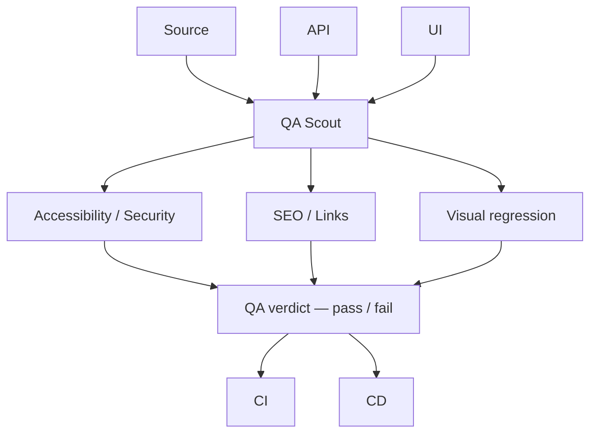

# QA Scout

  

**QA Scout catches bugs before your users do.**

One QA system. One verdict. One report.

Crawl your website, run automated QA gates, collect evidence, and generate a client-ready report.

Source, API, and UI go in. You get one verdict and one report: a short PDF for the client plus a zip for engineers.

## Download

**macOS, Apple Silicon:** [Releases](https://github.com/asxyw/qa-scout-app/releases)

Current build: **0.1.72**.

## Install on Mac

1. Download `QA-Scout-0.1.72-mac-arm64.zip` and unzip it.
2. Move `QA Scout.app` to Applications, or run it from Downloads.
3. First launch: **right-click → Open**. macOS will warn because this build is not Apple-notarized yet. Confirm Open.
4. Sign in, or start a **3-run trial** on this Mac.

Intel Macs are not in this release.

## Use it

1. Save a project with the site URL.
2. Run **Standard**. That is pages, SEO, accessibility, visual, headers, and links. API is included when the crawl already saw same-origin XHR, or when you attach an OpenAPI file.
3. Optional: paste a **public GitHub URL** and Clone. That turns on Source, CI, and CD (workflows, artifacts, no plaintext secrets). A github.com Base URL stays the website — it is not the repo.
4. Export: short client PDF (plain language) and a developer zip (`developers.md`, `findings.json`, evidence).

No signal on a gate means skip, not a fake pass.

## Early access

QA Scout is currently in early access. [Request free beta access](https://scout-api.win) (30 days, 20 runs/mo) to try it on your project. Reply goes to the email you give.

[Privacy / Datenschutz](https://scout-api.win/privacy/) · Telegram [@asxyw](https://t.me/asxyw)

## License

Trial: **3 runs** per computer. A new account does not give another trial on the same Mac.

Crawl data, screenshots, and PDFs stay on your Mac.

## Requirements

- macOS on Apple Silicon
- Network access to the site you scan

This repository is the download page. It does not contain product source.

## Author

[asxyw](https://github.com/asxyw)
