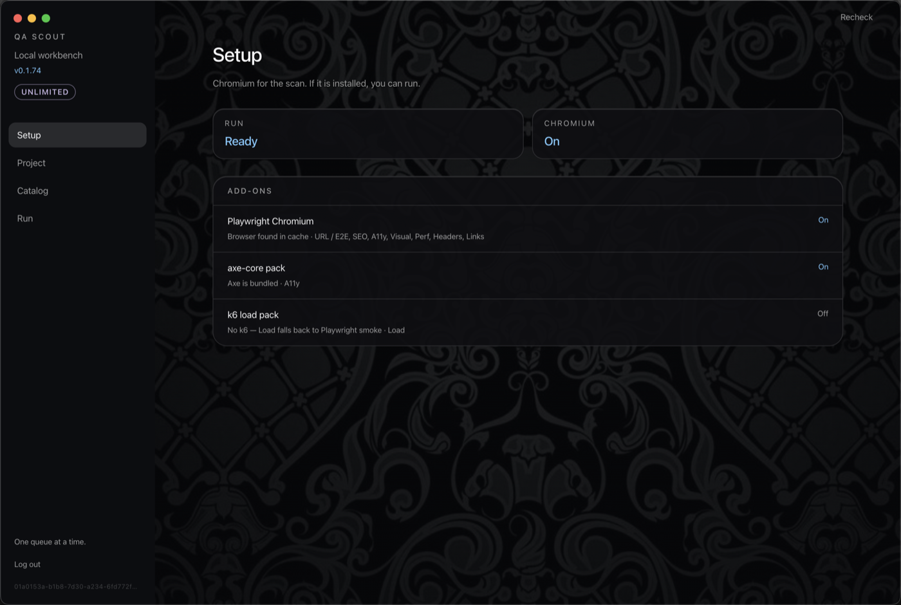
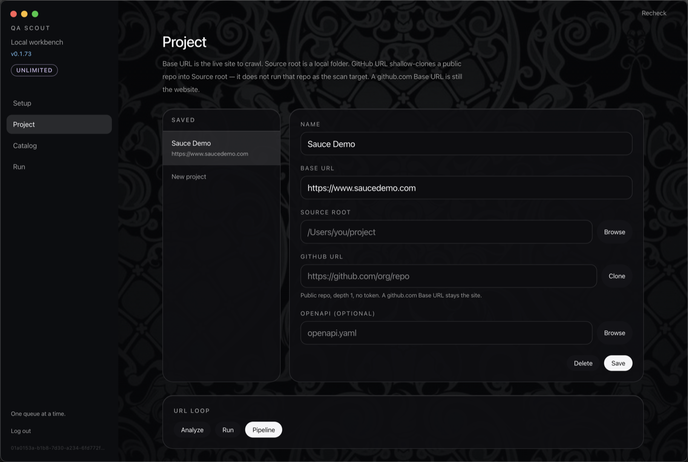
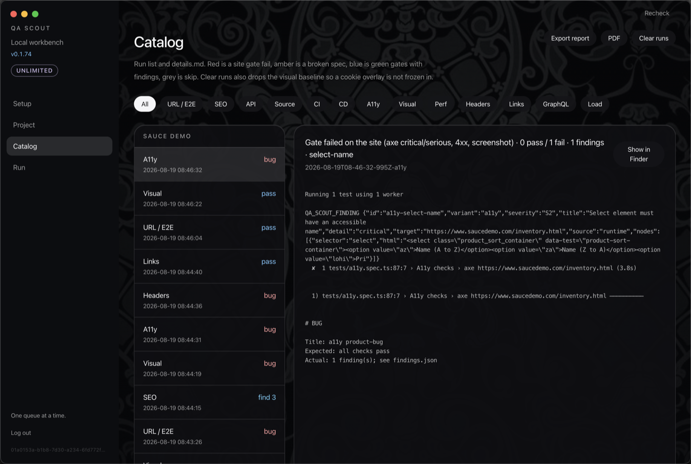
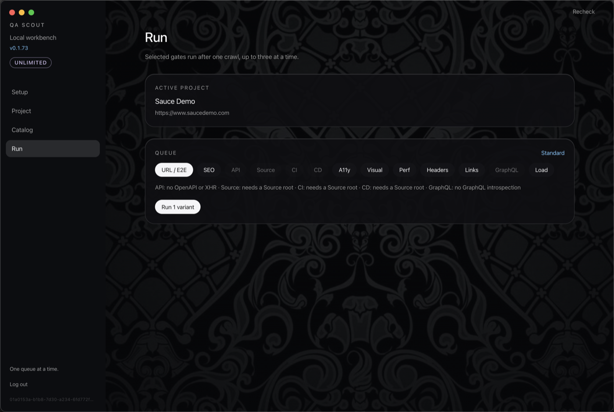
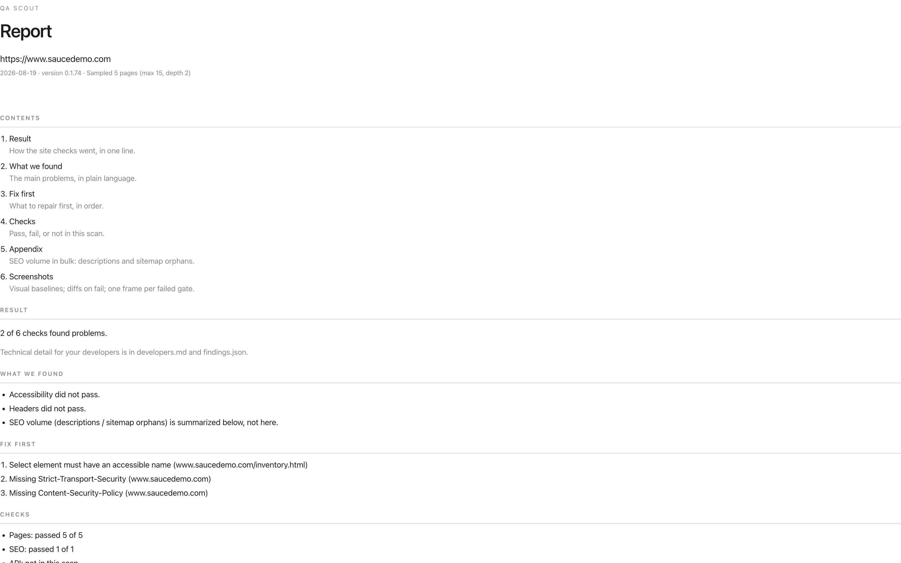
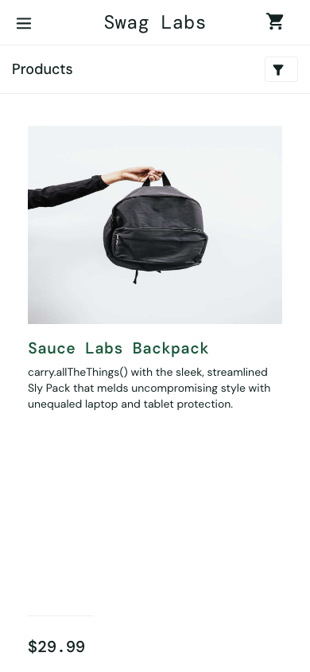
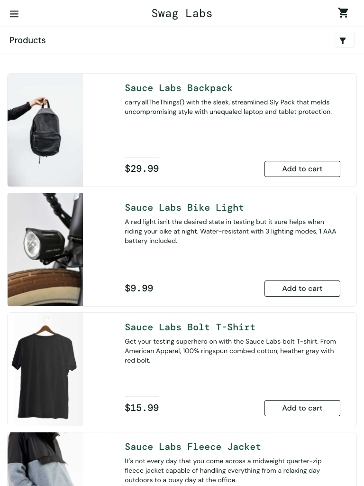
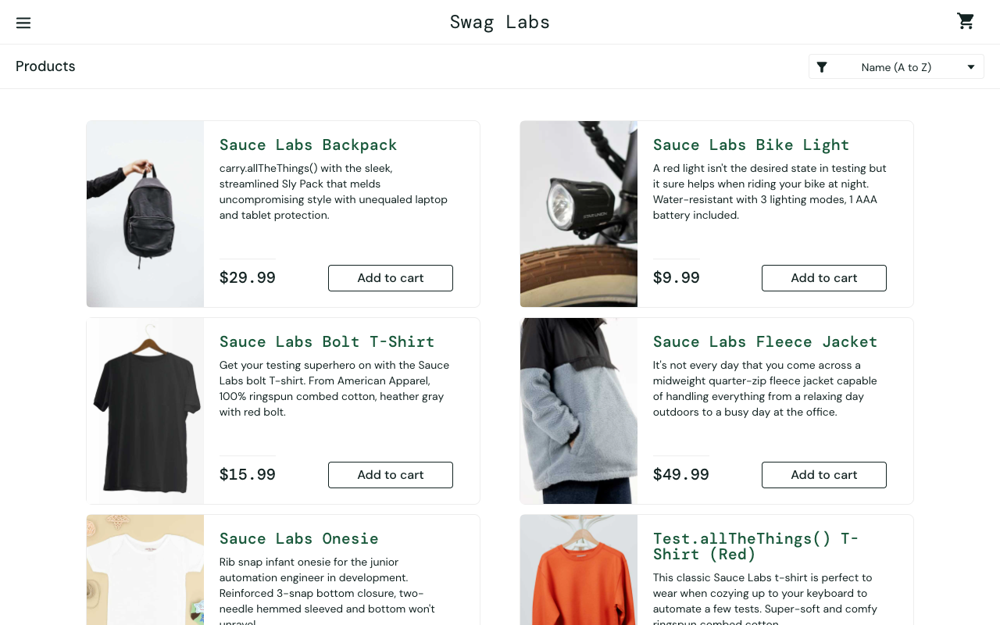
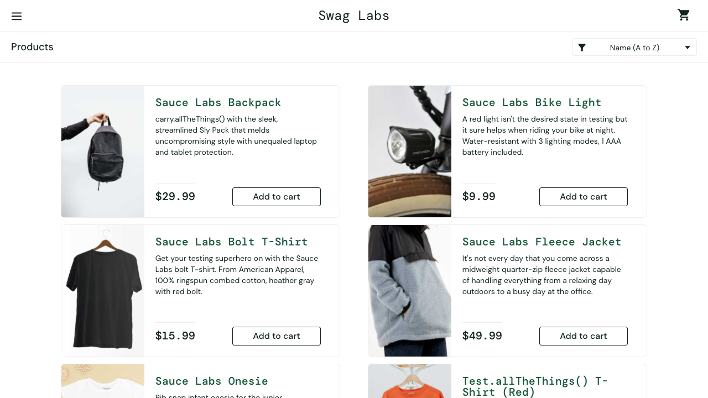

  

<h1 align="center">QA Scout</h1>

<strong>One QA system. One verdict. One report.</strong>

  
  
  

## Overview

QA Scout is a Mac app that crawls a website, runs pages, SEO, accessibility, visual, headers, and links in one pass, and returns a single verdict: a short client PDF plus a developer zip.

After you sign in, the same account data (runs left, time remaining, Scout ID) is on this Mac, on the website, and in the Telegram bot. You get those from the app and the welcome email — this page is the download.

## Screenshots

Sample project: [Sauce Demo](https://www.saucedemo.com) (Sauce Labs’ public test store, not a real shop).

### Setup

### Project

### Catalog

### Run

## Sample scan

Standard gates on Sauce Demo: pages, SEO, accessibility, visual, headers, links. API / Source / CI / CD / GraphQL had no context in this scan (skip, not a fake pass).

**Client PDF:** [report.pdf](docs/sample/report.pdf) · [report.md](docs/sample/report.md)

**Full pack (all fronts):** [qa-scout-report.zip](docs/sample/qa-scout-report.zip) · [developers.md](docs/sample/developers.md) · [findings.json](docs/sample/findings.json)

Visual baselines (mobile, tablet, desktop) and the accessibility fail:

## Download

**macOS, Apple Silicon:** [Releases](https://github.com/asxyw/qa-scout-app/releases)

Intel Macs are not in this release.

## Install

1. Download the latest `QA-Scout-*-mac-arm64.zip` and unzip it.
2. Move `QA Scout.app` to Applications, or run it from Downloads.
3. First launch: **right-click → Open**. macOS will warn because this build is not Apple-notarized yet. Confirm Open.
4. Sign in, or start a **3-run trial** on this Mac.

First screen is Setup — Chromium on, then you can run.

## Early access

QA Scout is in early access. [Request free beta access](https://scout-api.win) (30 days, 20 runs/mo). Reply goes to the email you give.

Crawl data, screenshots, and PDFs stay on your Mac. Trial: **3 runs** per computer. A new account does not give another trial on the same Mac.

[Privacy / Datenschutz](https://scout-api.win/privacy/)

## Author

[asxyw](https://github.com/asxyw)
